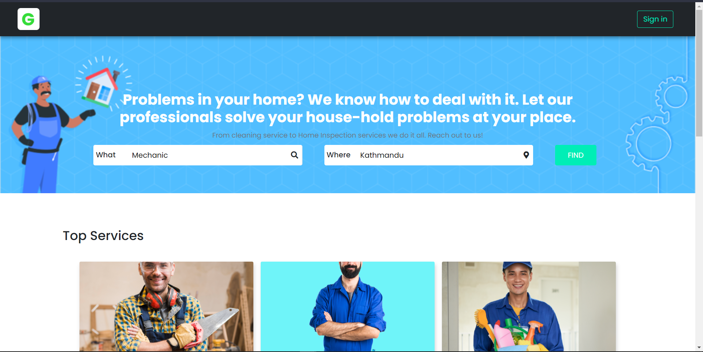
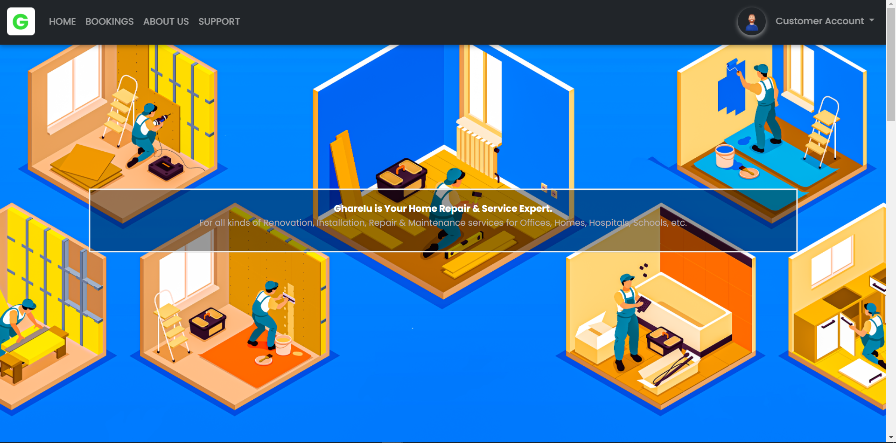
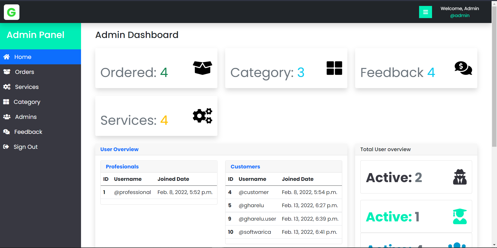

# Gharelu :house:

The Project **Gharelu** is developed using **django** , **Python**, **HTML**, **CSS**, **Bootstrap**, **JS**, **jQuery** &amp; **MySQL**.

## Project Setup

The first thing to do is to clone the repository:

```sh
$ git clone https://github.com/coder-dipesh/gharelu.git
$ cd gharelu
```

Then install the requirements:

```sh
$ python -m pip install Django
$ pip install django-bootstrap-form
$ pip install django-filter
$ pip install django-crispy-forms 
```


Once `pip` has finished downloading the dependencies:
```sh
$ cd project
$ python manage.py makemigrations
$ python manage.py migrate
$ python manage.py runserver
```
And navigate to `http://localhost:8000/`


Boom :boom: now you are running gharelu website. 

## Tests

To run the tests, `cd` into the directory where `manage.py` is:
```sh
$ python manage.py test app_name
```


 ## Tools & Technology Used
 
 The tools used for this project are as shown below. If you don't have those tools you can follow below link to download.
 
 ### Tools🛠
 
 - [Github](https://github.com/signup?ref_cta=Sign+up&ref_loc=header+logged+out&ref_page=%2F&source=header-home) :octocat: for source code management.
 - [Git](https://git-scm.com/downloads) as version control.
 - [Xammp](https://dev.mysql.com/downloads/workbench/) is used for running phpmyadmin.
 - [Photoshop](https://www.adobe.com/products/photoshop/free-trial-download.html) to edit required images.
 - [VsCode](https://code.visualstudio.com/) as a editor for writing code for whole project.

 
 ### Technology👨‍💻
 
 - [Python](https://www.python.org/) as main programming language.
 - [Django](https://www.djangoproject.com/) as python framework.
 - [Html](https://html.com/) for giving the structure for webapp.
 - [CSS](https://www.w3schools.com/Css/) to beautify the html structure.
 - [JS](https://www.javascript.com/) to add behaviour in webapp.
 - [jQuery](https://jquery.com/) to add behaviour in simple way.
 - [Bootstrap](https://getbootstrap.com/) to write less css codes and save time.


 ## Screenshot🖼
 Few **Screenshot** of project are show below :
<table>

   <tr>
    <td> </td>
   </tr>
  <tr>
    <td></td>
  </tr>
  <tr>
    <td></td>
  </tr>
  
  
 </table>
 

## Credits
**Websites, Blog Posts, Documentation**

### Coding 👨‍💻

[Read The Docs](https://django-docs.readthedocs.io/en/latest/) 

[Django Docs](https://docs.djangoproject.com/en/4.0/)

[Stack Overflow](https://stackoverflow.com/)


### Icon & Color 
[Fontawesome](https://fontawesome.com/v4.7/icons/)

[Color Hunt](https://colorhunt.co/palettes/black)

 
## Contrubutiors

[coder-dipesh](https://github.com/coder-dipesh/) 

[coder-nilesh](https://github.com/coder-nilesh)

[Pooja Rijal](https://github.com/pooja9009)

[Karma Gurung](https://github.com/KarmaGurung75)


